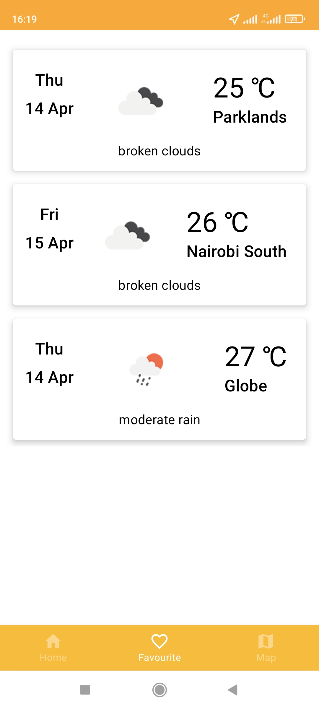

# Weather-app

Requirements
----

- Weather application to display the current weather at the user's location and a 5-day
  forecast.
  - The application connects to the [openweathermap API](https://openweathermap.org/current) to
    collect weather information

### How it's built

* Technologies used
  * [Kotlin](https://kotlinlang.org/)
  * [Jetpack Compose](https://developer.android.com/jetpack/compose)
  * [Coroutines](https://kotlinlang.org/docs/reference/coroutines-overview.html)
  * [Flow](https://kotlinlang.org/docs/reference/coroutines/flow.html)
  * [KOIN Dependency](https://insert-koin.io/)
  * [Retrofit](https://square.github.io/retrofit/)
    * [Jetpack](https://developer.android.com/jetpack)
        * [Lifecycle](https://developer.android.com/topic/libraries/architecture/lifecycle)
        * [ViewModel](https://developer.android.com/topic/libraries/architecture/viewmodel)
* [Timber](https://github.com/JakeWharton/timber)

* Architecture
  * MVVM - Model View View Model

* Tests
    * [JUnit5](https://junit.org/junit5/)
    * [Spek](https://www.spekframework.org/)
    * [MockK](https://github.com/mockk/mockk)
    * [Turbine](https://github.com/cashapp/turbine)

* Gradle
  * [Gradle Kotlin DSL](https://docs.gradle.org/current/userguide/kotlin_dsl.html)
  * Plugins
    * [Spotless](https://github.com/diffplug/spotless)
    * [Dokka](https://github.com/Kotlin/dokka)
    * [jacoco](https://github.com/jacoco/jacoco)
    * [Ktlint](https://github.com/JLLeitschuh/ktlint-gradle)
    * [Detekt](https://github.com/detekt/detekt)

* CI/CD
  * Github Actions

### Weather app screenshots

| 
||  
||  |
